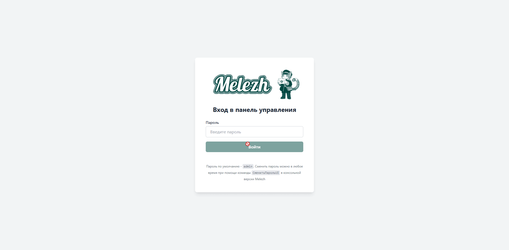

# Melezh

[](https://en.openintegrations.dev/) [](https://github.com/EvilBeaver/OneScript) [](https://boosty.to/bayselonarrend)

Server platform providing a unified configurable HTTP API for processing requests using arbitrary `.os` code or ready-made functions from the Open Integration Package. The system includes numerous tools for quickly and flexibly building your own service, as well as for its ongoing maintenance and administration

## How It Works

The solution lets you create handlers for incoming HTTP requests based on methods from the Open Integration Package or functions from arbitrary OneScript modules. Each handler can be assigned a URL, method (GET, POST with JSON, or POST with form-data), and default parameter values. HTTP parameters map directly to the handler function's parameters without manual HTTP request handling. The system automatically processes data, maps addresses to assigned handlers, rejects requests with unsupported methods or invalid data, and logs all events. For convenient server management and log viewing, Melezh includes a built-in web console

## Initial setup example

This example creates a new project file with a GET request handler configuration for the `SendTextMessage` function from the Telegram library. It also sets a default value for the `token` parameter with no overwrite capability ("strict")

```powershell

melezh CreateProject      --path R:\test_proj.melezh
melezh AddRequestsHandler --proj R:\test_proj.melezh --lib telegram --func SendTextMessage --method GET
melezh SetHandlerArgument --proj R:\test_proj.melezh --handler 42281f11b --arg token --value "***" --strict true
melezh RunProject         --proj R:\test_proj.melezh --port 7788

```

The handler will be available at `localhost:7788/42281f11b`, where `42281f11b` is the identifier obtained when calling `AddRequestHandler`. This identifier serves both as the handler's configuration key and as the URL endpoint for requests

Request example for sending a text message:

```url
http://localhost:7788/42281f11b?chat=123123123&text="Hello world!"
```

As you may have noticed, we're not passing the token as it's set by default

## Web UI

In addition to the CLI interface, for easier interactive configuration and management, you can use the web console built into Melezh:



*On the recording: logging into the console, adding a new handler for creating a Bitrix24 news item with two default parameters specified, disabling two handlers, viewing details of one of the recent events, reviewing all logs for one of today’s handlers*

<br>

**The web console allows you to:**
- Monitor the server’s latest events
- Add, modify, and delete handlers, or adjust default parameter sets
- Temporarily enable or disable handlers
- View detailed logs for each processed request
- Modify server settings

If you’re just getting started with Melezh, this mode is recommended. Access the web console at `localhost:<your_port>/ui` after creating and launching the project

## Installation


<br>

Melezh can be installed using a Windows installer, rpm or deb package, OneScript package, or within a Docker container. The required files are available in the releases of this repository <br><hr>
*Learn more about the installation method and process on the [documentation page](https://en.openintegrations.org/docs/Addons/Melezh/Start/Installation)*

<br>

## Documentation


<br>

More information about console commands, logging, Web UI capabilities, and working with Melezh in general can be found in the [online documentation](https://en.openintegrations.dev/docs/Addons/Melezh).  It is hosted on the same portal as the documentation for the main project - Open Integration Package, where you can also find information about methods available as handler functions within Melezh. The documentation is available in two language versions - Russian and English

<br><br>

## Sponsors [?](https://boosty.to/bayselonarrend/purchase/3429871?ssource=DIRECT&share=subscription_link)

The companies listed below support the development of the Open Integration Package and make significant contributions to its progress.

||
|-|
|  |
| **GreenAPI** <br/> Stable WhatsApp API <br/> Gateway <br/> <br/> [green-api.com](https://green-api.com/en) 🌍 |

## Support the project


If you like this or my other projects, you can support me [on Boosty](https://boosty.to/bayselonarrend) (regularly or one-time). With a subscription of 500 rubles (~6 dollars) or more, you'll get access to a private Telegram chat where you can ask questions about the project and receive direct assistance from me.

**Thanks for your support!**
